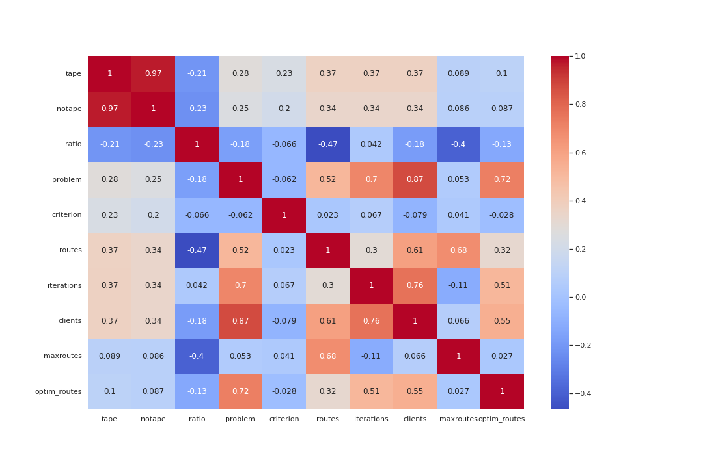
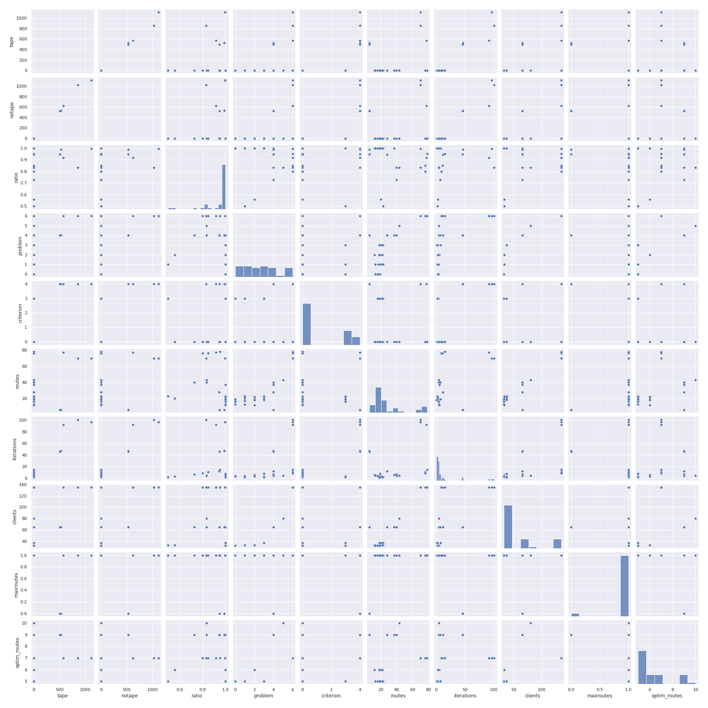
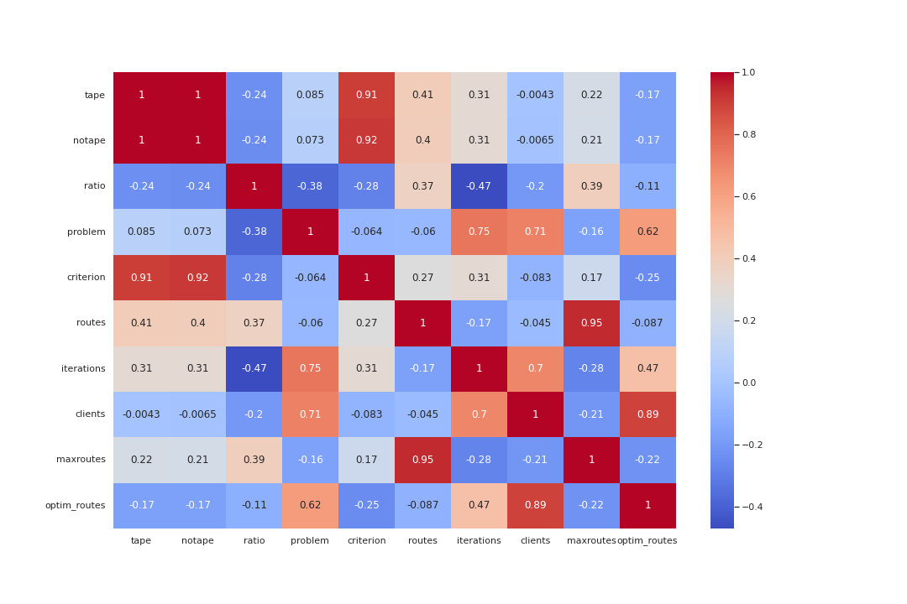
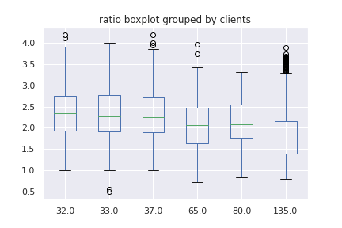

# Resultados

## Medidas básicas

## Correlación

Algunas correlaciones presentes

**Alta** correlación directa entre:

- *tape* y *notape*: Ambos representan tiempos de corrida de algoritmos al mismo problema. Esto indica que el análisis en esta matriz relacionados va a ser casi idéntico.

**Media** correlación directa entre:

- *iterations* y *clients*: Es lógico pensar que para problemas de mayor espacio de búsqueda la cantidad de iteraciones realizadas por los algoritmos sea mayor.
- *clients* y *routes*: Lo cual siguiendo la linea de pensamiento anterior, tiene sentido que a mayor cantidad de clientes exista una mayor cantidad de rutas.
- *routes* y *maxroutes*: Se puede pensar como que empezando por una solución factible (maxroutes=1) inicial los
algoritmos tienden a hacer más iteraciones que empezando por una solución no factible (maxroutes=0)

**Débil** correlación inversa entre:

- *ratio* y *routes*: Al parecer existe una relación no muy marcada entre estos dos atributos que hace que a medida que aumente las rutas en la solución inicial del problema tiende a disminuir el ratio.

## Análisis de ratio <= 1

Dado que los que cumplen este criterio cumplen que la corrida con evaluación automática fue mejor o igual que la corrida sin esta, tiene significancia ver que propiedades cumplen este grupo.

En este grupo se encontraron 40 entradas, lo que representa un 1.6% de la muestra.

Entre las características que presentan dichas corridas se encuentran:

- La mayoría de los ratios se encuentra próximos a 1.
- La mayoría empezó con una solución inicial factible.
- La mayoría se realizaron en menos de 25 iteraciones.
- La mayoría se realizaron con menos de 50 clientes.
- El criterio RAB fue el más observado.

## Análisis Outliers

Se eliminaron los outliers del atributo ratio por el método de IQR, estos datos representan solamente 15 entradas siendo todos superiores, no llegando al 1% de la muestra.

En los outliers se muestra la siguiente tabla de correlación, aunque esta no tiene mucha significación estadística por la poca cantidad de elementos que la conforman da a conocer información sobre estos.

En estos datos aparecieron nuevas correlaciones con respecto al ratio, aunque débiles, por ejemplo la correlación inversa entre el ratio y las iterations.

## Análisis de clients

Se observa un ligero comportamiento decreciente en el **ratio** a medida que aumenta la cantidad de clientes.
Aunque solamente se tiene medida de 32, 33, 37, 65, 80, 135 clientes respectivamente.

## Análisis de criterion

El análisis del criterio indica que individualmente no influye en el ratio. Se realizó un test de ANOVA sobre la colección dando como resultado que este no tenia influencia sobre el valor del ratio.

Aumentando nuestro análisis sobre este tema se investigó si la cantidad de clientes y el criterio afectaban el ratio llegando a la conclusión de que iba disminuyendo la media a medida que aumentaba la cantidad de clientes, reforzando lo mostrado anteriormente:

En la imagen se observa en el eje x una tupla que representa (criterio, cantidad de clientes) por donde se filtraron los ratios para hallarle el boxplot. Se observa un leve descenso con el aumento de los clientes.

Además de que los criterios 1,3,4 y 5 poseen una menor varianza en cuanto al ratio, independientemente de la cantidad de clientes.

## Recomendaciones

- Se recomienda probar con una cantidad mayor de clientes para verificar el comportamiento visto en **Análisis de clients**
